# D288 Final Project

Created by Nate Edge

Western Governor's University
Course D288 - Back-End Programming

# *Travel App*

**Application Description:** This application is the newly created back-end for a 
previously existing Angular front end for a Travel Agency's Web App. The backend fetches data 
from an existing MySQL database, and was built with Java and Spring Boot. It was initialized
with the following dependencies: Spring Data JPA, Rest Repositories, MySQL Driver, and Lombok.

# Created Packages:
Bootstrap
<ul>
<li>BootStrapData</li>
</ul>
Config
<ul>
<li>RestDataConfig (Previously existing file)</li>
</ul>
Controllers
<ul>
<li>CheckoutController</li>
</ul>
DAO
<ul>
<li>CartItemRepository</li>
<li>CartRepository</li>
<li>CountryRepository</li>
<li>CustomerRepository</li>
<li>DivisionRepository</li>
<li>ExcursionRepository</li>
<li>VacationRepository</li>
</ul>
Entities
<ul>
<li>Cart</li>
<li>CartItem</li>
<li>Country</li>
<li>Customer</li>
<li>Division</li>
<li>Excursion</li>
<li>StatusType (Enum)</li>
<li>Vacation</li>
</ul>
Services
<ul>
<li>CheckoutService.java</li>
<li>CheckoutServiceImplementation</li>
<li>Purchase</li>
<li>PurchaseResponse</li>
</ul>
Main App (TravelAppApplication)

Resources:
<ul>
<li>Static</li>
<ul>
<li>Screenshots (Screenshots used in README)</li>
</ul>
<li>Application.properties (Modified packages to match app changes)</li>
</ul>

# Code Description (Rubric Requirements)
**(A) Create a Java Project using Spring Initializr** All dependencies can be found on the 
pom.xml file.

**(B) Commit all changes in GitLab** All commit history and details can be found at the following 
[this repo](https://gitlab.com/wgu-gitlab-environment/student-repos/nate_edge/d288-back-end-programming)
in the branch titled 'working_branch'. An additional hard copy will also be submitted via PDF in the 
WGU Submission Files.

**(C) Construct four new packages: controllers, entities, dao, and services:** All packages can be found 
inside the src/main/com/example/travelApp directory.

**(D) Write code for the entities package that includes entity classes and the enum designed to match
the UML diagram.** The entites package contains Java classes for: Cart, CartItem, Country, Customer, 
Division, Excursion, and Vacation. All variables match and are mapped to the existing Angular front-end
and all column names are mapped to the existing MySQL Full Stack E-commerce database. The entities package
also contains a class called StatusType, which matches the enum design in the UML diagram provided.

**(E) Write code for the dao package that includes repository interfaces for the entites that extend
the JpaRepository and add cross-origin support:** The dao package contains the following java interfaces:
CartItemRepository, CartRepository, CountryRepository, CustomerRepository, DivisionRepository, ExcursionRepository
VacationRepostiory. All interfaces extend JpaRepository and include cross-origin support for "http://localhost:4200"

**(F) Write code for the service package:**
<ul>
<li>A purchase data class with a customer cart and set of cart items: Found in Purchase.java</li>
<li>A purchase response data class that contains an order tracking number: Found in PurchaseResponse.java</li>
<li>A checkout service interface: Found in the CheckoutService Interface</li>
<li>A checkout service implementation class. Found in CheckoutServiceImplementation.java</li>
</ul>

**(G) Write code to include validation to enforce the inputs needed by the Angular front-end** Validation
to enforce front-end inputs can be found inside the Customer.java class located in the entities package. The 
code is enforced using nullable = false inside the @Column on variables requiring input. These variables include:
firstName, lastName, address, postal_code, phone, and customer id.

**(H) Write code for the controllers package that includes a REST controller checkout 
controller class with a post mapping to place orders** Found in the CheckoutController class inside the 
controllers package.

**(I) Add Five Sample Customers to the application and ensure customer info is not overwritten** The customer
data is added inside the BootStrapData class found inside the Bootstrap package (Lines 26-30). Code is added
to prevent overwriting (Lines 32-37). A commented out line of code (Line 24), can be used to reset the customers
in the database.

**(J)** All screenshots found below.

# Screenshots
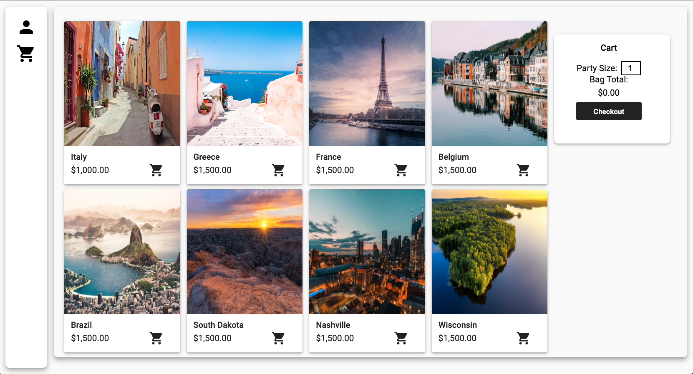

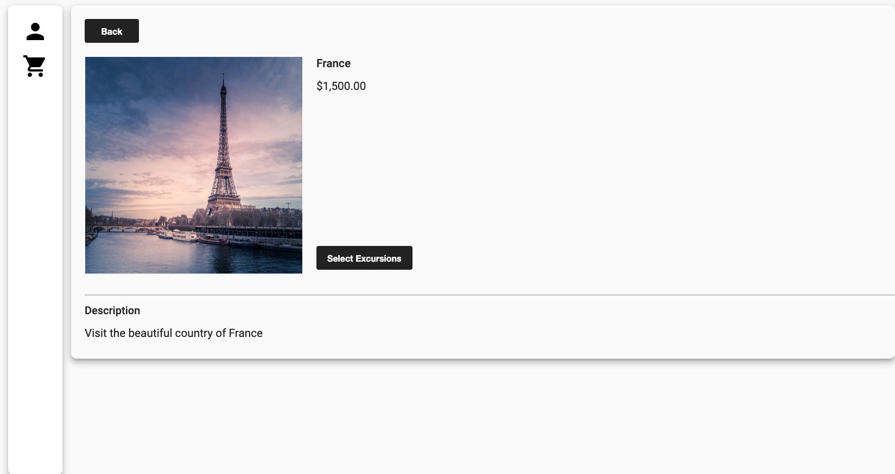

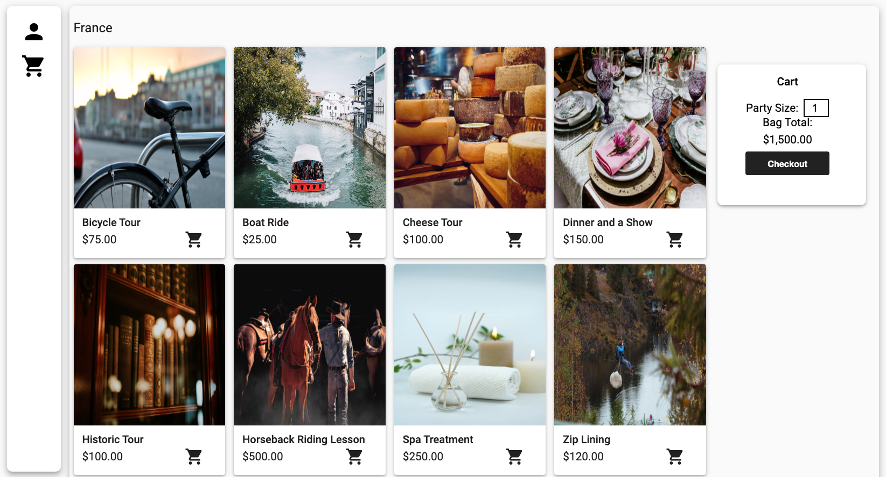

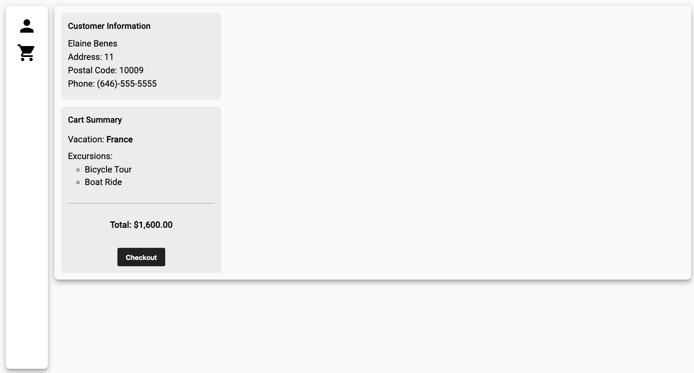

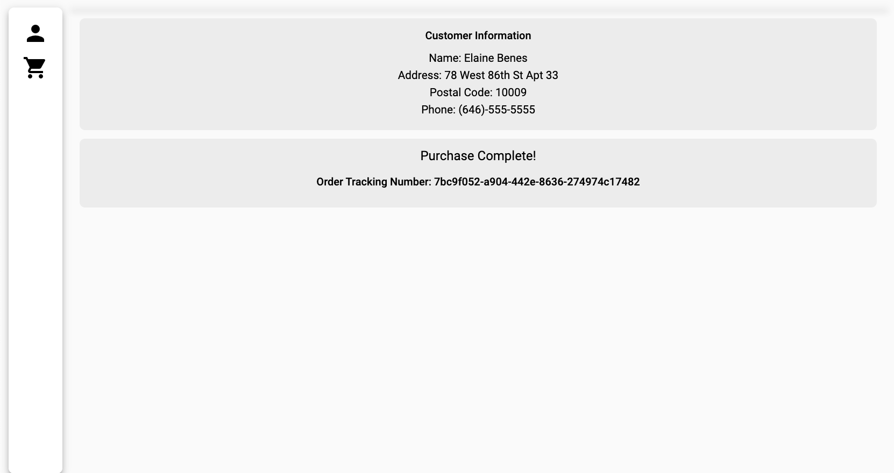

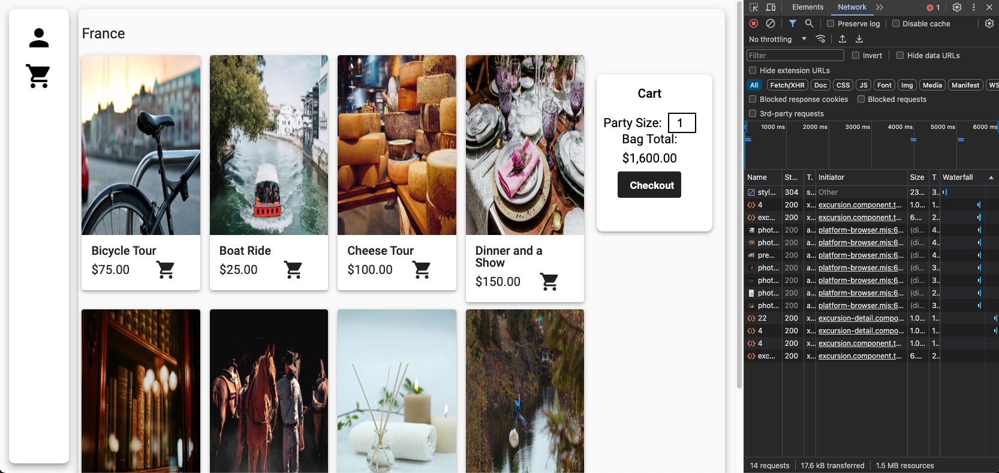

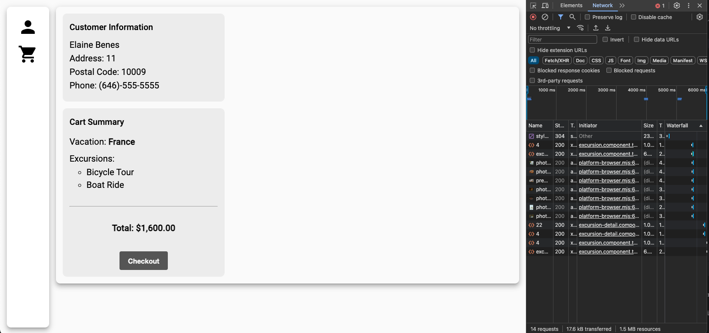

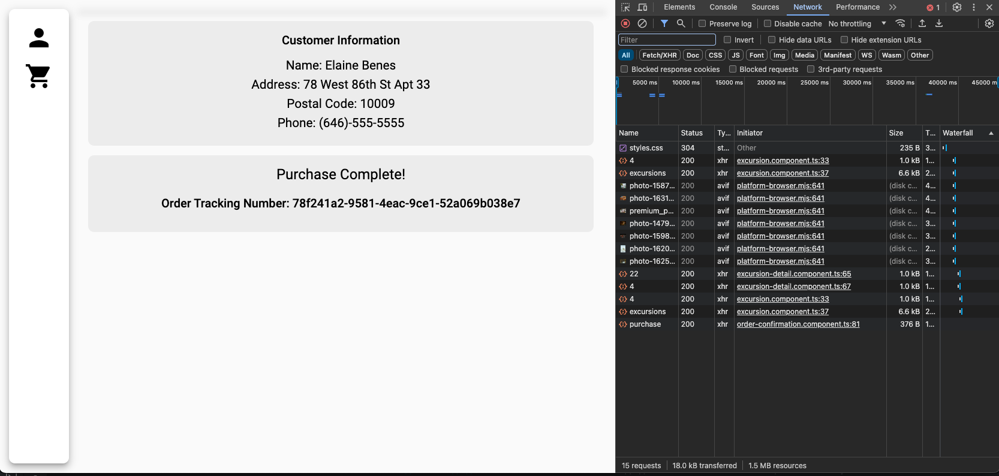

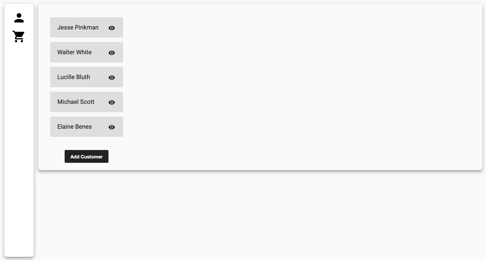

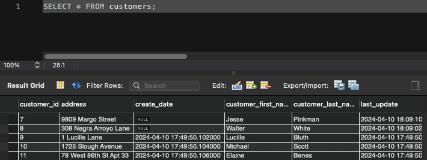

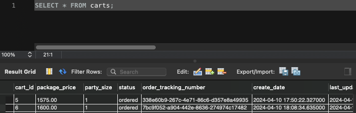

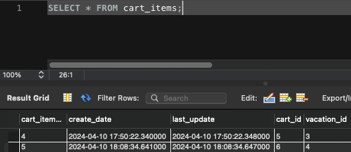

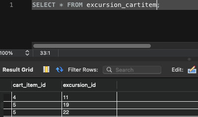

